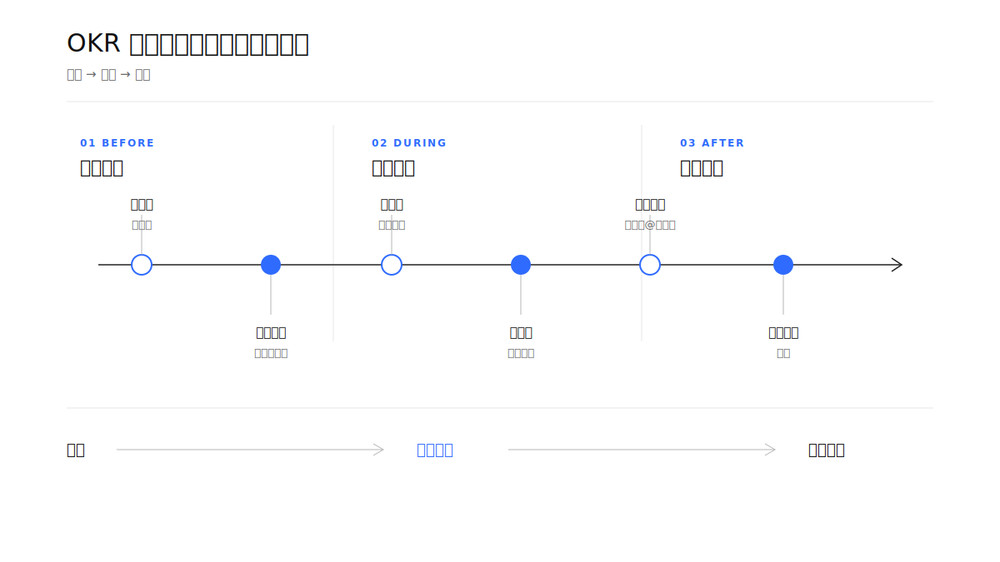
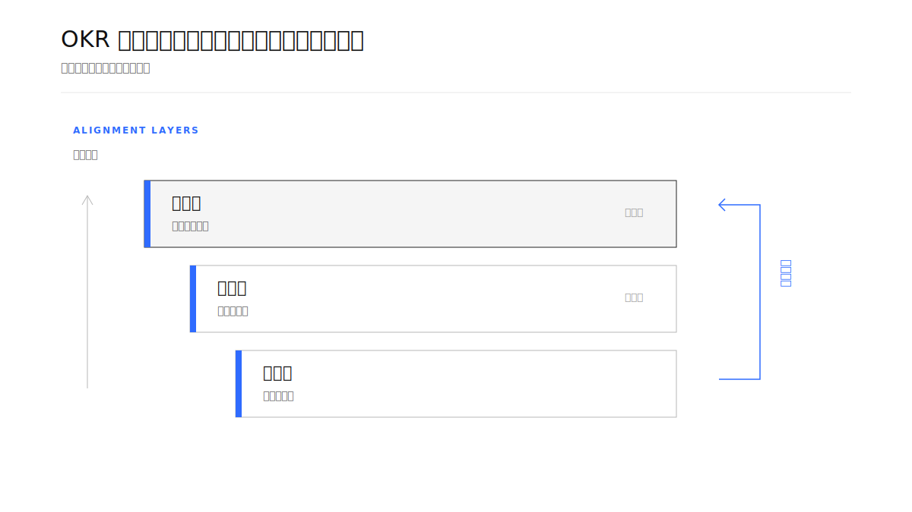
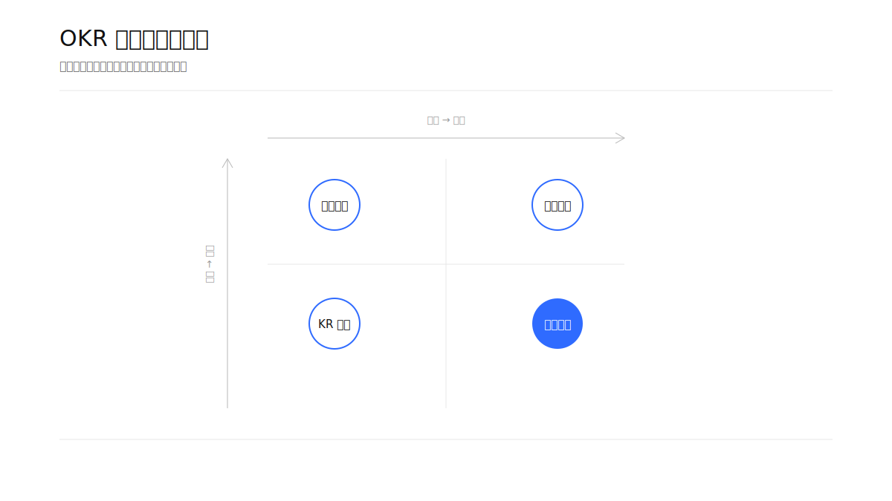
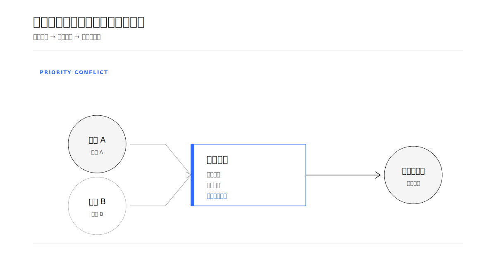
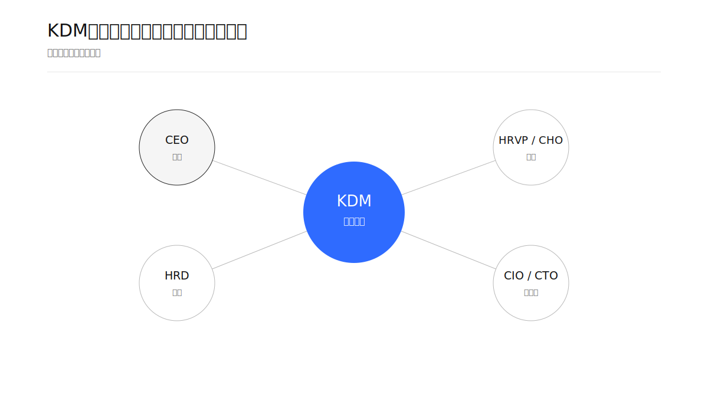
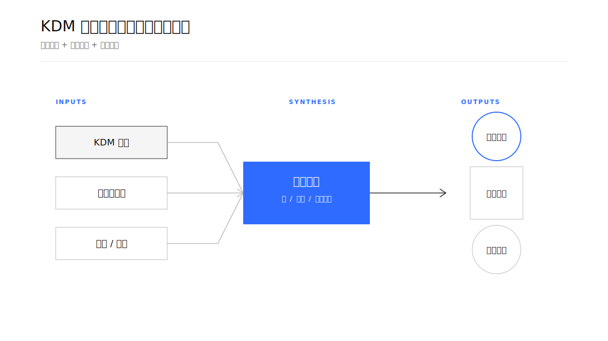
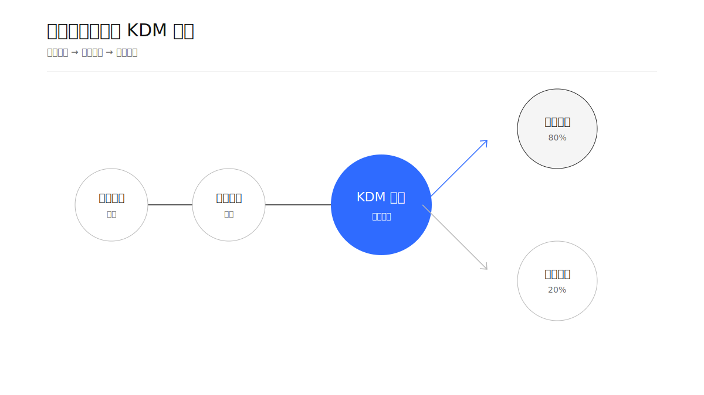
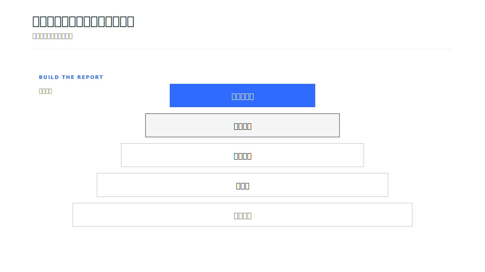

# Geometry Board｜几何视觉画板

把复杂内容压缩成一张“一图一意”、克制少字、可插入飞书文档的几何视觉画板。

这是一个面向 Codex 的 Skill。它负责从自然语言、飞书文档段落或已有图示中提炼核心判断，选择合适的几何构图，生成结构化 Scene JSON，再渲染为 SVG/PNG；当用户要求插入飞书云文档时，还会把每张画板放到对应主题段落附近，而不是统一堆在文档末尾。

## 名字

- 英文名：`Geometry Board`
- 中文名：`几何视觉画板`
- Skill ID：`geometry-board`

## 它解决什么问题

长文档里的信息经常同时包含流程、层级、角色、输入输出和判断标准。几何视觉画板不追求把全文塞进一张图，而是先回答：

> 这张图要让读者一眼理解什么？

然后只保留一个核心判断，用节点、线、层级、留白和单一强调色表达关系，把完整解释留给正文。

## 核心工作流

```text
读取内容 → 提炼核心判断 → 抽取关系 → 选择构图
        → 生成 Scene JSON → 校验 → 渲染 SVG/PNG
        → 视觉审查 → 按主题插入飞书文档 → 读回验证
```

支持的主要构图包括：

| 构图 | 适合表达 |
| --- | --- |
| `axis-flow` | 时间、流程、因果、演进 |
| `layered-architecture` | 技术、产品、组织分层 |
| `radial-center` | 一个中心连接多个对象 |
| `matrix-2d` | 分类、优先级、风险与影响 |
| `input-process-output` | 输入、机制、输出与闭环 |
| `dot-filter` | 群体筛选、转化、规模收敛 |
| `section-space` | 内部结构、平台能力、空间层次 |
| `tension-contrast` | 冲突、权衡、旧新模式 |

## 视觉原则

- 默认画布 `1200 × 675`，比例 `16:9`
- 白色背景，黑白灰为主，只使用一个强调色
- 充足留白，优先保证关系清晰和缩小后的可读性
- 默认“少字模式”：标题 + 关键词节点 + 必要关系词
- 中文可见文字默认不超过 80 字，复杂结构硬上限 120 字
- 单个节点尽量控制在 2–8 个汉字
- 不使用蓝紫渐变、玻璃拟态、大面积阴影、卡通图标和模板化 SmartArt

## 飞书文档中的分段插入

这是本 Skill 的重要行为：画板不仅要生成得对，还要放得对。

1. 读取文档大纲、标题层级、段落顺序和已有画板。
2. 为每张图建立 `主题 → 对应章节/段落 → 插入锚点` 映射。
3. 默认把画板插在对应解释段落之后、下一主题标题之前。
4. 多张画板按正文主题出现顺序分散插入；同一主题的多张图才保持连续。
5. 保留原文已有画板及相对位置，不默认重排。
6. 写入后读回每个画板前后的文本，核对画板主题与段落主题是否匹配。

只有用户明确要求“集中展示”时，才会把多张画板放在同一处。

## 示例

下面的示例来自两份实际飞书文档：一份围绕 OKR 对齐与评审，另一份围绕 People 干系人 / KDM 汇报。示例保留了同一套视觉系统，但每张图只承担一个主题。

### 示例一：OKR 对齐与评审

#### OKR 对齐会：把目标拉齐为方向



#### OKR 对齐：先管理层，再部门层，最后团队层



#### OKR 评审的四个问题



#### 跨部门优先级冲突：对齐的是价值



### 示例二：People 干系人 / KDM 汇报

#### KDM：关键角色不是名单，而是决策权



#### KDM 诉求：先听见，再形成画像



#### 汇报目标：先让 KDM 满意



#### 汇报内容搭建：先骨架，再填充



## 目录结构

```text
geometry-board/
├── SKILL.md                         # Skill 主说明与工作流
├── agents/openai.yaml               # Codex 中的展示信息
├── references/
│   ├── visual-system.md              # 视觉 Token 与构图模板
│   └── scene-json-schema.md          # Scene JSON 协议
├── scripts/validate_scene.py         # Scene JSON 结构校验
└── examples/                         # 实际画板 SVG 示例
    ├── okr/
    └── kdm/
```

## 使用方式

在 Codex 中调用 `$geometry-board`，例如：

```text
Use $geometry-board to turn this section into a minimal geometric board.
```

也可以直接提出“把这段内容画成一张图”“把这份飞书文档视觉化”或“在对应段落插入 4 张画板”等请求。

## 校验

对 Scene JSON 运行：

```bash
python3 scripts/validate_scene.py path/to/scene.json
```

校验通过后，再进行 SVG/PNG 渲染和飞书文档写入。
