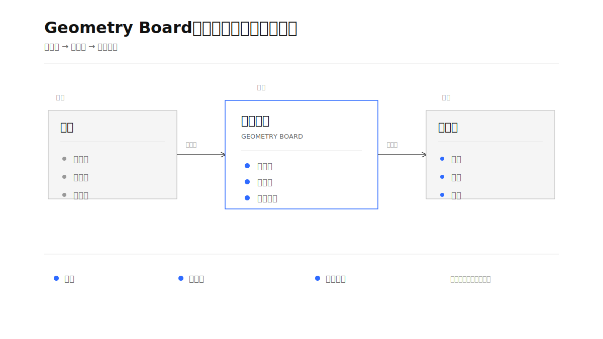

# 蓝点几何画板｜Geometry Board

把复杂内容压缩成一张“一图一意”、直白易懂、简洁克制、有几何编辑感、可插入飞书文档的几何视觉画板。

[English introduction](#english-introduction)

这是一个面向 Codex 的 Skill。它负责从自然语言、飞书文档段落或已有图示中提炼核心判断，选择合适的几何构图，生成结构化 Scene JSON，再渲染为 SVG/PNG；当用户要求插入飞书云文档时，还会把每张画板放到对应主题段落附近，而不是统一堆在文档末尾。

## 一张图看懂蓝点几何画板

<p align="center">
  
</p>

## 名字

- 英文名：`Geometry Board`
- 中文名：`蓝点几何画板`
- Skill ID：`geometry-board`

## 它解决什么问题

长文档里的信息经常同时包含流程、层级、角色、输入输出和判断标准。几何视觉画板不追求把全文塞进一张图，而是先回答：

> 这张图要让读者一眼理解什么？

然后只保留一个核心判断，用节点、线、层级、留白和单一强调色表达关系，把完整解释留给正文。

## 它的价值

### 1. 把复杂信息变成可讨论的对象

长文档适合完整记录，但不一定适合快速理解。Geometry Board 把流程、层级、角色、依赖、冲突和判断标准转成一张结构清楚的图，让团队可以围绕同一个视觉对象讨论“谁影响谁、先做什么、哪里需要决策”。

### 2. 把“好看”建立在信息关系上

它不是给文字套一个装饰模板，也不是生成一张无法编辑和解释的海报。先抽取关系，再决定构图；圆、线、层、轴和留白各自承担稳定的语义，视觉形式服务于内容判断。

### 3. 让画面有几何编辑感

它更像一张正在被编辑的结构图，而不是一组信息卡片：主轴、辅助线、定位点、边界、截面和空间距离都用来说明关系。高级感来自比例、对齐、留白、线条层级和克制的对比，不来自阴影、渐变、图标或更多组件。

### 4. 让图和正文各司其职

画板负责让读者快速看到结构，正文负责承载背景、证据和细节。少字不是删掉信息，而是把信息放回最合适的载体，避免一张图同时承担标题、说明、例子和结论。

### 5. 让陌生读者也能马上看懂

画板中的文字优先使用日常业务语言和具体动作。标题先说结论，节点尽量回答“谁做什么、先做什么、结果是什么”，少用必须依赖术语表才能理解的抽象词。直白不是随意口语化，而是在保持专业和准确的前提下，让信息少绕一步。

### 6. 让画板真正进入文档阅读流

当内容来自飞书云文档时，画板会按主题分散到对应段落，而不是生成完 4 张图后统一堆在文档末尾。读者在读到一个主题时，就能在上下文中看到对应的关系图。

### 7. 让结果可复用、可校验、可迭代

中间使用 Scene JSON 表达意图、节点和关系，输出使用确定性 SVG/PNG。这样既能检查结构约束，也能在用户说“少一点字”“换成流程图”“保留这个风格”时进行局部修改，而不必从零开始重画。

## 点线面体：核心视觉语言

Geometry Board 的核心不是“把内容画成几何图标”，而是用点、线、面、体把关系画出来：

| 元素 | 表达什么 |
| --- | --- |
| 点 | 对象、角色、事件、信号、状态 |
| 线 | 连接、路径、方向、依赖、流动 |
| 面 | 群组、阶段、范围、环境、共同属性 |
| 体 | 系统、层级、空间剖面、整体结构 |

关系通过位置、距离、尺度、方向、线宽、对齐、重复、包含、重叠、透明度和空白被看见。点可以排列成线，线可以展开成面，面通过叠层、切面或轴测形成体；体积感服务于结构，不用写实光影装饰。

设计原则来自同一套视觉语法：重复与变化形成节奏，尺度建立层级，接近与相似形成分组，连续与方向形成路径，边界与图层表达范围，透明度表达交叠，网格和模块保持秩序，规则与有限随机性制造变化。

默认使用白底、黑白灰和唯一的 `#2F6BFF` Geometry Blue。蓝色面积小而位置准，只标出核心对象、主路径、当前状态、风险或变化。蓝色圆点不是必备装饰：只有当它定位了变化、反馈、决策、信号或当前焦点，并且真实改变了一条关系时才使用；没有明确语义就不用。详细规则见 [点线面体与视觉关系语言](references/design-language.md)。

### 8. 适合需要克制表达的业务场景

它尤其适合 OKR 对齐、项目复盘、客户汇报、KDM 识别、流程梳理、产品架构、组织协同和决策讨论等场景：信息复杂，但最终需要让同事快速看懂并继续行动。

## 核心工作流

```text
读取内容 → 提炼核心判断 → 抽取关系 → 选择构图
        → 生成 Scene JSON → 校验 → 渲染 SVG/PNG
        → 视觉审查 → 按主题插入飞书文档 → 读回验证
```

支持的主要构图包括：

| 构图 | 适合表达 |
| --- | --- |
| `axis-flow` | 时间、流程、因果、演进 |
| `layered-architecture` | 技术、产品、组织分层 |
| `radial-center` | 一个中心连接多个对象 |
| `matrix-2d` | 分类、优先级、风险与影响 |
| `input-process-output` | 输入、机制、输出与闭环 |
| `dot-filter` | 群体筛选、转化、规模收敛 |
| `section-space` | 内部结构、平台能力、空间层次 |
| `tension-contrast` | 冲突、权衡、旧新模式 |

## 什么时候用卡片，什么时候用点和线

不是所有内容都要画成点线，也不是所有内容都要装进卡片。先判断读者要看的是对象本身，还是对象之间的关系：

| 表达方式 | 适合情况 |
| --- | --- |
| 卡片 | 独立模块、并列比较、明确边界、每项有自己的短说明 |
| 点和线 | 顺序、路径、依赖、网络、流动、信号、变化、共同中心 |
| 混合 | 模块边界真实存在，同时模块之间有重要路径或依赖 |

判断方法很简单：去掉边框后关系仍然清楚，就优先用点和线；去掉边界后独立模块无法识别，才保留卡片。卡片不是禁用项，卡片墙才是问题。先做这个判断，再选择构图模板；不要因为熟悉某种模板，就把所有内容都改造成同一种容器。

## 版式原则

- 居中：主视觉中心落在画布主轴或有意设置的视觉中心，文字中心与几何中心一致。
- 对齐：使用 8 px 网格、共同基线、共同轴线和统一内边距；对齐是为了让关系可读，不是把所有元素机械排成一列，不接受“差一点”的错位。
- 排列：默认左到右、上到下，一张图只保留一条主路径，相关元素成组，连线尽量不交叉。
- 紧密度：同组更紧，相关组适中，独立组拉开；距离表达关系强弱，不把元素平均铺满画布。
- 密度：关系密集处可以紧凑，但必须有层级；关系稀疏处保留空白，不用组件填空。
- 关系优先：如果边框只是装饰或遮住主路径，就改用点、线、面、层或空间距离。

## 视觉原则

- 默认画布 `1200 × 675`，比例 `16:9`
- 白色背景，黑白灰为主，只使用一个强调色
- 默认强调色为 `#2F6BFF`（Geometry Blue）
- 充足留白，优先保证关系清晰和缩小后的可读性
- 默认“少字模式”：标题 + 关键词节点 + 必要关系词
- 文字优先直白易懂，先写具体动作和结果，再考虑抽象概念
- 画面优先呈现几何关系，不做等尺寸卡片墙
- 一个主焦点、一条主路径，其他元素降低视觉重量
- 中文可见文字默认不超过 80 字，复杂结构硬上限 120 字
- 单个节点尽量控制在 2–8 个汉字
- 不使用蓝紫渐变、玻璃拟态、大面积阴影、卡通图标和模板化 SmartArt

## 飞书文档中的分段插入

这是本 Skill 的重要行为：画板不仅要生成得对，还要放得对。

1. 读取文档大纲、标题层级、段落顺序和已有画板。
2. 为每张图建立 `主题 → 对应章节/段落 → 插入锚点` 映射。
3. 默认把画板插在对应解释段落之后、下一主题标题之前。
4. 多张画板按正文主题出现顺序分散插入；同一主题的多张图才保持连续。
5. 保留原文已有画板及相对位置，不默认重排。
6. 写入后读回每个画板前后的文本，核对画板主题与段落主题是否匹配。

只有用户明确要求“集中展示”时，才会把多张画板放在同一处。

## 示例

下面的示例来自两份实际飞书文档：一份围绕 OKR 对齐与评审，另一份围绕 People 干系人 / KDM 汇报。示例保留了同一套视觉系统，但每张图只承担一个主题。

### 示例一：OKR 对齐与评审

#### OKR 对齐会：把目标拉齐为方向

<p align="center">
  
</p>

#### OKR 对齐：先管理层，再部门层，最后团队层

<p align="center">
  
</p>

#### OKR 评审的四个问题

<p align="center">
  
</p>

#### 跨部门优先级冲突：对齐的是价值

<p align="center">
  
</p>

### 示例二：People 干系人 / KDM 汇报

#### KDM：关键角色不是名单，而是决策权

<p align="center">
  
</p>

#### KDM 诉求：先听见，再形成画像

<p align="center">
  
</p>

#### 汇报目标：先让 KDM 满意

<p align="center">
  
</p>

#### 汇报内容搭建：先骨架，再填充

<p align="center">
  
</p>

## English introduction

### What it is

Geometry Board is a Codex Skill for turning dense business content into clear, plain-language, restrained, low-text geometric diagrams that can be reviewed, exported, and embedded into Feishu documents.

It works from natural-language prompts, selected document sections, or existing diagrams. The Skill extracts the core message, identifies the underlying relationships, selects a suitable composition, generates a structured Scene JSON, and renders a deterministic SVG or PNG.

### Why it matters

Business documents often mix timelines, ownership, dependencies, decision rights, inputs, outputs, and evaluation criteria in the same page. A generic diagram generator may produce something visually attractive but semantically loose, text-heavy, or disconnected from the document context.

Geometry Board is designed around six practical outcomes:

1. **Faster understanding.** One board communicates one core judgment at a glance.
2. **Plain-language clarity.** Titles and nodes use concrete actions and outcomes so an unfamiliar reader can understand the board without a glossary.
3. **Semantic fidelity.** Shapes, lines, layers, axes, and whitespace represent meaningful relationships instead of decoration.
4. **Better reading flow.** Boards are placed beside the section they explain, so the visual and written context stay together.
5. **Reusable output.** Scene JSON and deterministic SVG make revisions, validation, and style consistency easier.
6. **Actionable discussion.** The board gives teams a shared object for discussing priorities, ownership, risks, and next steps.

### What makes it different

Geometry Board treats visual work as information design rather than image generation:

- It starts with a single core message, not a collection of unstructured labels.
- It prefers plain business language and concrete verbs over abstract jargon.
- It has an editorial geometric feel rather than a card-grid UI: axes, guide lines, anchor points, boundaries, and spatial relationships remain visible when they help explain the structure.
- It maintains one clear focal point and one primary path instead of giving every module equal visual weight.
- It chooses cards for independent, bounded, comparable modules; points and lines for paths, dependencies, networks, and flows; and a hybrid only when both boundaries and relationships matter.
- It applies explicit layout rules for centering, alignment, reading order, grouping, spacing, and relationship-driven density.
- It uses point, line, plane, and volume as a generative visual language: points locate objects, lines reveal movement and connection, planes define groups and fields, and volume shows layered systems or spatial structure.
- It uses rhythm, scale, Gestalt grouping, framing, layers, transparency, modularity, grids, pattern, time, and controlled rules to make relationships legible without adding decoration.
- It chooses the representation before the composition template, so a familiar template never overrides the actual relationship.
- It treats alignment as a tool for readable relationships, not as mechanical column-making; decorative containers are removed when they hide the main path.
- It uses a small, stable visual vocabulary and one accent color.
- It removes redundant explanations before shrinking text or filling empty space.
- It preserves existing boards unless the user explicitly asks for a rearrangement.
- It verifies the document structure and the placement context after writing to Feishu.

### Feishu document behavior

When several boards are requested for a Feishu document, the Skill first reads the document outline and nearby paragraphs. It then creates a mapping of `board topic → section → insertion anchor`, places each board after the paragraph that introduces its topic, and verifies the text before and after every inserted board. Boards are clustered only when they belong to the same topic or when the user explicitly requests a gallery-style section.

### Example sources

The examples in this repository come from two real document-oriented use cases: OKR alignment and review, and People stakeholder / KDM reporting. They demonstrate how the same visual system can express different structures without turning the board into a full-text slide.

## 目录结构

```text
geometry-board/
├── SKILL.md                         # Skill 主说明与工作流
├── agents/openai.yaml               # Codex 中的展示信息
├── references/
│   ├── visual-system.md              # 视觉 Token 与构图模板
│   └── scene-json-schema.md          # Scene JSON 协议
├── scripts/validate_scene.py         # Scene JSON 结构校验
└── examples/                         # 实际画板 SVG 示例
    ├── overview/                     # Skill 总览画板与 Scene JSON
    ├── okr/
    └── kdm/
```

## 使用方式

在 Codex 中调用 `$geometry-board`，例如：

```text
Use $geometry-board to turn this section into a minimal geometric board.
```

也可以直接提出“把这段内容画成一张图”“把这份飞书文档视觉化”或“在对应段落插入 4 张画板”等请求。

## 校验

对 Scene JSON 运行：

```bash
python3 scripts/validate_scene.py path/to/scene.json
```

校验通过后，再进行 SVG/PNG 渲染和飞书文档写入。
