> “Less, but better.” — Dieter Rams

<div align="center">

### **蓝色波点 · Blue Dot**

**旅行者号回望时，那里只有一颗安静的蓝色波点。**

<br>

*在 AI 生成已经满溢的今天，保留一点蓝色的克制。*
*少画一点，才看得清。*

</div>

---

<h1 align="center">蓝色波点几何画板｜Blue Dot</h1>

<p align="center">
  
  
  =3.8">
  
</p>

把复杂内容压缩成一张“一图一意”、直白易懂、简洁克制、有几何编辑感、可插入飞书文档的几何视觉画板。

[English introduction](#english-introduction)

这是一个面向 Codex 的 Skill。它负责从自然语言、飞书文档段落或已有图示中提炼核心判断，选择合适的几何构图，生成结构化 Scene JSON，再渲染为 SVG/PNG；当用户要求插入飞书云文档时，还会把每张画板放到对应主题段落附近，而不是统一堆在文档末尾。

## Agent 使用契约（运行前必读）

Agent 先确认内容来源、读者、交付格式和是否需要写入飞书，再提炼一张图的一条核心判断。生成前校验关系与构图，生成后校验 Scene、渲染结果和插入位置。

| 项目 | 规则 |
| --- | --- |
| 触发 | 把自然语言、飞书文档选中文本或已有图示转成几何画板；修改已有画板；插入飞书文档 |
| 首步 | 确认读者要理解的判断、内容范围、图的数量和交付格式 |
| 输入 | 文本/文档段落/已有图示、受众、关系、约束和目标段落 |
| 输出 | Scene JSON、SVG/PNG、构图说明；写入飞书时附插入位置和读回状态 |
| 质量门槛 | `scripts/validate_scene.py` 通过；视觉检查无溢出、遮挡、无语义节点和明显连线交叉 |
| 写入 | 默认先交付本地预览；写入需要用户确认目标文档、账号/租户和插入方式，写后回读 |
| 降级 | 关系不清或内容更适合表格/数据图时，明确建议缩小范围或换表达方式 |

画板承担核心判断和关系，正文承担背景、证据和链接。两者重复时，删除正文导语，不靠增加图中文字补解释。

## 一张图看懂蓝色波点几何画板

<p align="center">
  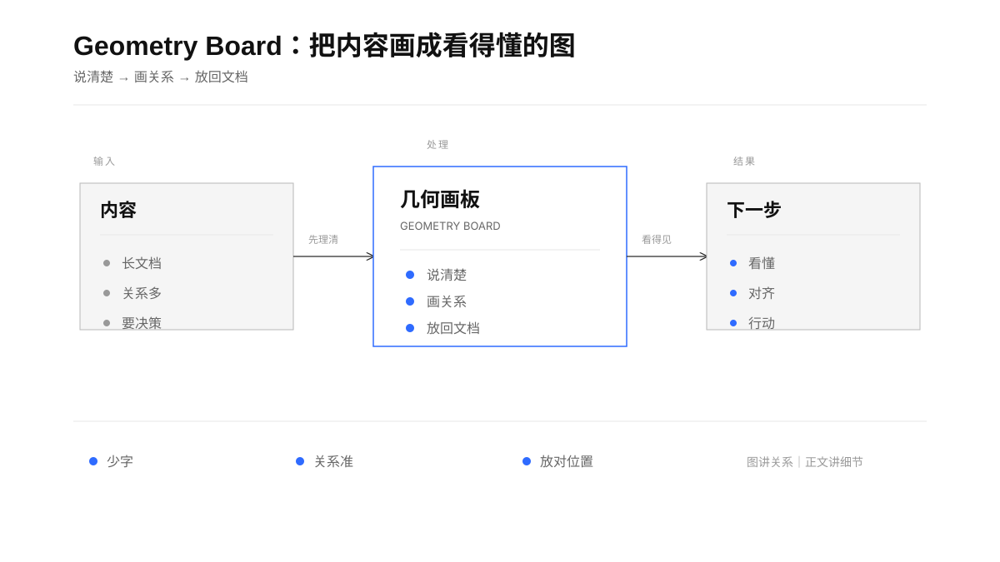
</p>

## 名字

- 英文名：`Blue Dot`
- 中文名：`蓝色波点几何画板`
- Skill ID：`geometry-board`

## 它解决什么问题

长文档里的信息经常同时包含流程、层级、角色、输入输出和判断标准。几何视觉画板不追求把全文塞进一张图，而是先回答：

> 这张图要让读者一眼理解什么？

然后只保留一个核心判断，用节点、线、层级、留白和单一强调色表达关系；画板用必要副标题补充一行解释，正文保留背景、证据和细节，避免两处重复。

## 它的价值

### 1. 把复杂信息变成可讨论的对象

长文档适合完整记录，但不一定适合快速理解。蓝色波点把流程、层级、角色、依赖、冲突和判断标准转成一张结构清楚的图，让团队可以围绕同一个视觉对象讨论“谁影响谁、先做什么、哪里需要决策”。

### 2. 把“好看”建立在信息关系上

它不是给文字套一个装饰模板，也不是生成一张无法编辑和解释的海报。先抽取关系，再决定构图；圆、线、层、轴和留白各自承担稳定的语义，视觉形式服务于内容判断。

### 3. 让画面有几何编辑感

它更像一张正在被编辑的结构图，而不是一组信息卡片：主轴、辅助线、定位点、边界、截面和空间距离都用来说明关系。高级感来自比例、对齐、留白、线条层级和克制的对比，不来自阴影、渐变、图标或更多组件。

### 4. 让图和正文各司其职

画板负责让读者快速看到核心判断、关系和必要副标题，正文负责承载背景、证据、链接和细节。少字的关键是把解释放回最合适的载体：画板消除局部理解障碍，正文提供阅读理由和可核验信息；画板插入后，正文删去重复导语。

### 5. 让陌生读者也能马上看懂

画板中的文字优先使用日常业务语言和具体动作。技术和非技术共读时，先说明读者能获得的共同语言、判断标准、应用边界或下一步动作，再出现必要术语。标题先说结论，副标题补充一行“为什么/怎么用”，节点回答“谁做什么、先做什么、结果是什么”，少用必须依赖术语表才能理解的抽象词。直白不是随意口语化，而是在保持专业和准确的前提下，让信息少绕一步。

### 6. 让画板真正进入文档阅读流

当内容来自飞书云文档时，画板会按主题分散到对应段落，而不是生成完 4 张图后统一堆在文档末尾。读者在读到一个主题时，就能在上下文中看到对应的关系图。

### 7. 让结果可复用、可校验、可迭代

中间使用 Scene JSON 表达意图、节点和关系，输出使用确定性 SVG/PNG。这样既能检查结构约束，也能在用户说“少一点字”“换成流程图”“保留这个风格”时进行局部修改，而不必从零开始重画。

## 点线面体：核心视觉语言

蓝色波点的核心不是“把内容画成几何图标”，而是用点、线、面、体把关系画出来：

| 元素 | 表达什么 |
| --- | --- |
| 点 | 对象、角色、事件、信号、状态 |
| 线 | 连接、路径、方向、依赖、流动 |
| 面 | 群组、阶段、范围、环境、共同属性 |
| 体 | 系统、层级、空间剖面、整体结构 |

关系通过位置、距离、尺度、方向、线宽、对齐、重复、包含、重叠、透明度和空白被看见。点可以排列成线，线可以展开成面，面通过叠层、切面或轴测形成体；体积感服务于结构，不用写实光影装饰。

设计原则来自同一套视觉语法：重复与变化形成节奏，尺度建立层级，接近与相似形成分组，连续与方向形成路径，边界与图层表达范围，透明度表达交叠，网格和模块保持秩序，规则与有限随机性制造变化。

默认使用白底、黑白灰和唯一的 `#2F6BFF` Geometry Blue。蓝色面积小而位置准，只标出核心对象、主路径、当前状态、风险或变化。蓝色圆点不是必备装饰：只有当它定位了变化、反馈、决策、信号或当前焦点，并且真实改变了一条关系时才使用；没有明确语义就不用。直线负责轴线、边界和明确步骤，自然弧线负责流动、反馈和回路；多条弧线采用对称、镜像或等距偏移。详细规则见 [点线面体与视觉关系语言](references/design-language.md)。

### 8. 适合需要克制表达的业务场景

它尤其适合 OKR 对齐、项目复盘、客户汇报、KDM 识别、流程梳理、产品架构、组织协同和决策讨论等场景：信息复杂，但最终需要让同事快速看懂并继续行动。

## 核心工作流

```text
读取内容 → 提炼核心判断 → 抽取关系 → 选择构图
        → 生成 Scene JSON → 校验 → 渲染 SVG/PNG
        → 视觉审查 → 按主题插入飞书文档 → 读回验证
```

支持的主要构图包括：

| 构图 | 适合表达 |
| --- | --- |
| `axis-flow` | 时间、流程、因果、演进 |
| `layered-architecture` | 技术、产品、组织分层 |
| `radial-center` | 一个中心连接多个对象 |
| `matrix-2d` | 分类、优先级、风险与影响 |
| `input-process-output` | 输入、机制、输出与闭环 |
| `dot-filter` | 群体筛选、转化、规模收敛 |
| `section-space` | 内部结构、平台能力、空间层次 |
| `tension-contrast` | 冲突、权衡、旧新模式 |

## 多张画板：统一风格，变化构图

一组画板需要稳定的视觉系统，也需要足够不同的阅读方式。标题、字体、颜色、线宽和留白保持一致，主体关系区根据内容切换：

- 系统组成：经典汇聚，`输入 → 系统/Harness → 结果`
- 信息筛选：纵向漏斗
- 双类型或双资料库：对称双栏
- 工具连接真实世界：上下边界
- 有无增量：双路径对照
- 双条件判断：二维矩阵

4 张画板至少使用 3 种构图家族，6 张至少使用 4 种。系列开头可保留一张经典锚点图，帮助读者快速建立认知；构图变化服从内容关系，不为变化而变化。

标题还要通过“3 秒复述测试”：读者只看标题和主关系，就能说出核心判断。公式直接写公式，分类直接说“分两类”，条件直接说“满足两个条件才做”，具体动作直接写结果。

## 什么时候用卡片，什么时候用点和线

不是所有内容都要画成点线，也不是所有内容都要装进卡片。先判断读者要看的是对象本身，还是对象之间的关系：

| 表达方式 | 适合情况 |
| --- | --- |
| 卡片 | 独立模块、并列比较、明确边界、每项有自己的短说明 |
| 点和线 | 顺序、路径、依赖、网络、流动、信号、变化、共同中心 |
| 混合 | 模块边界真实存在，同时模块之间有重要路径或依赖 |

判断方法很简单：去掉边框后关系仍然清楚，就优先用点和线；去掉边界后独立模块无法识别，才保留卡片。卡片不是禁用项，卡片墙才是问题。先做这个判断，再选择构图模板；不要因为熟悉某种模板，就把所有内容都改造成同一种容器。

## 版式原则

- 居中：主视觉中心落在画布主轴或有意设置的视觉中心，文字中心与几何中心一致。
- 对齐：使用 8 px 网格、共同基线、共同轴线和统一内边距；对齐是为了让关系可读，不是把所有元素机械排成一列，不接受“差一点”的错位。
- 排列：默认左到右、上到下，一张图只保留一条主路径，相关元素成组，连线尽量不交叉。
- 紧密度：同组更紧，相关组适中，独立组拉开；距离表达关系强弱，不把元素平均铺满画布。
- 密度：关系密集处可以紧凑，但必须有层级；关系稀疏处保留空白，不用组件填空。
- 关系优先：如果边框只是装饰或遮住主路径，就改用点、线、面、层或空间距离。

## 视觉原则

- 默认画布 `1200 × 675`，比例 `16:9`
- 白色背景，黑白灰为主，只使用一个强调色
- 默认强调色为 `#2F6BFF`（Geometry Blue）
- 充足留白，优先保证关系清晰和缩小后的可读性
- 默认“少字模式”：标题 + 关键词节点 + 必要关系词
- 文字优先直白易懂，先写具体动作和结果，再考虑抽象概念
- 画面优先呈现几何关系，不做等尺寸卡片墙
- 一个主焦点、一条主路径，其他元素降低视觉重量
- 中文可见文字默认不超过 80 字，复杂结构硬上限 120 字
- 副标题可承担一行必要解释；正文与画板不重复表达同一局部判断
- 单个节点尽量控制在 2–8 个汉字
- 不使用蓝紫渐变、玻璃拟态、大面积阴影、卡通图标和模板化 SmartArt

## 飞书文档中的分段插入

这是本 Skill 的重要行为：画板不仅要生成得对，还要放得对。

1. 读取文档大纲、标题层级、段落顺序和已有画板。
2. 为每张图建立 `主题 → 对应章节/段落 → 插入锚点` 映射。
3. 默认把画板插在对应解释段落之后、下一主题标题之前。
4. 多张画板按正文主题出现顺序分散插入；同一主题的多张图才保持连续。
5. 保留原文已有画板及相对位置，不默认重排。
6. 写入后读回每个画板前后的文本，核对画板主题与段落主题是否匹配。
7. 若标题和副标题已经说清该段关系，正文采用“章节标题 → 画板”的紧凑结构，删除重复导语，保留背景、证据和链接。

只有用户明确要求“集中展示”时，才会把多张画板放在同一处。

## 示例

下面的示例来自两份实际飞书文档，以及一组对 Skill 工作方式的说明：OKR 对齐与评审、People 干系人 / KDM 汇报、从内容到画板的工作流。示例保留了同一套视觉系统，但每张图只承担一个主题。

### 示例一：OKR 对齐与评审

#### OKR 对齐会：把目标拉齐为方向

<p align="center">
  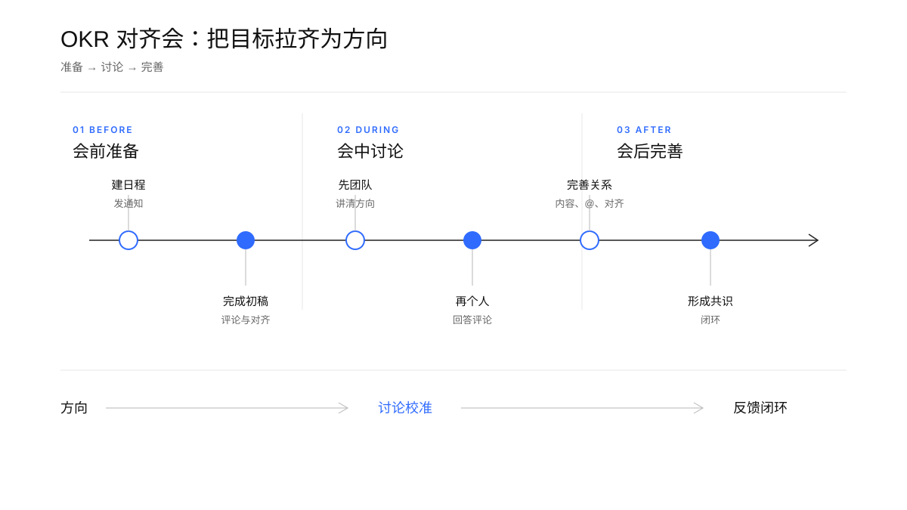
</p>

#### OKR 对齐：先管理层，再部门层，最后团队层

<p align="center">
  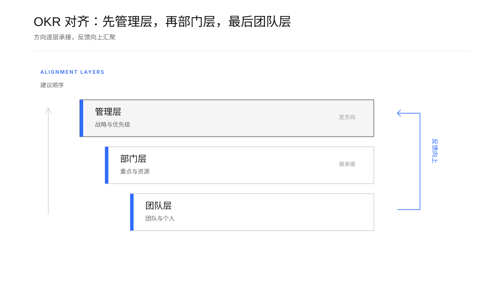
</p>

#### OKR 评审的四个问题

<p align="center">
  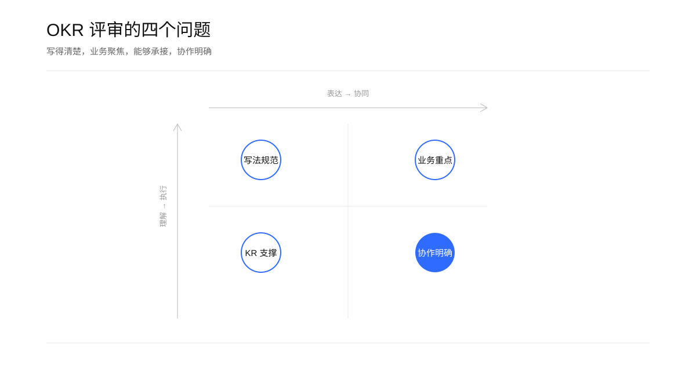
</p>

#### 跨部门优先级冲突：对齐的是价值

<p align="center">
  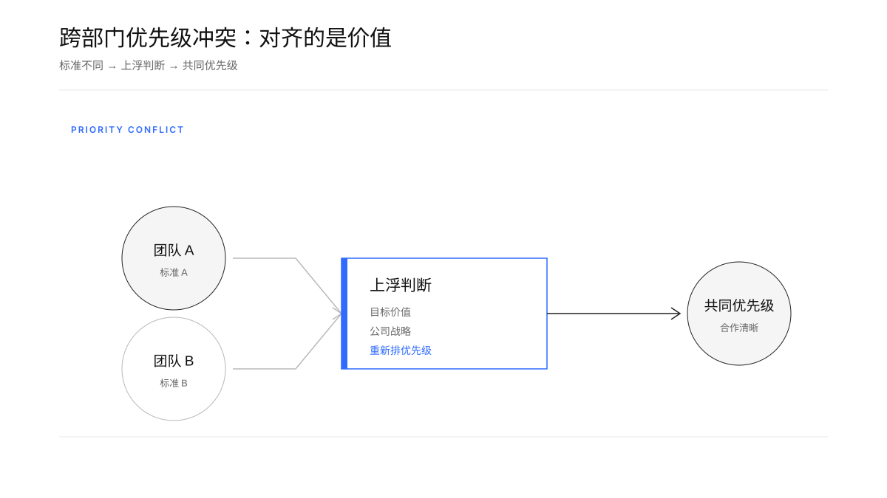
</p>

### 示例二：People 干系人 / KDM 汇报

#### KDM：关键角色不是名单，而是决策权

<p align="center">
  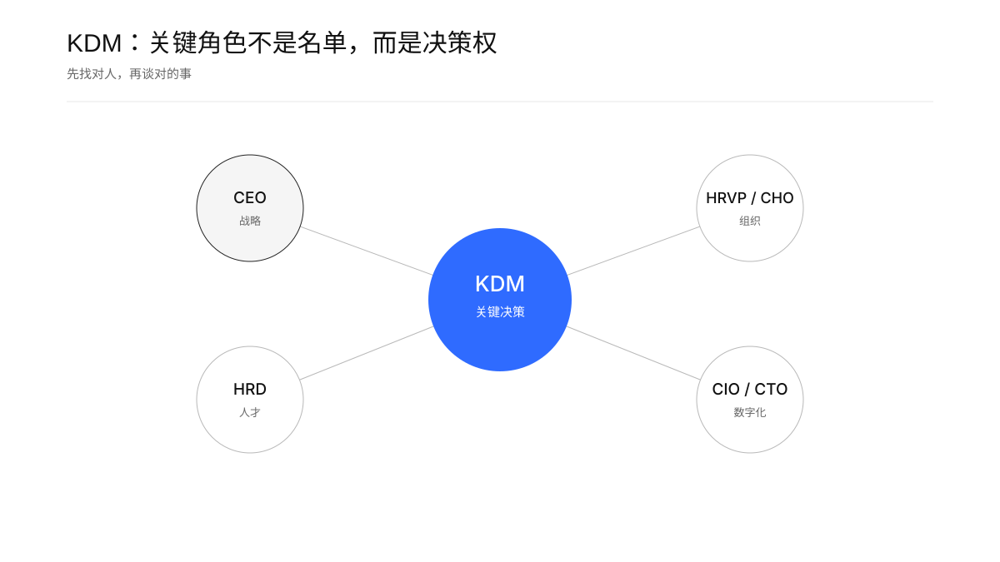
</p>

#### KDM 诉求：先听见，再形成画像

<p align="center">
  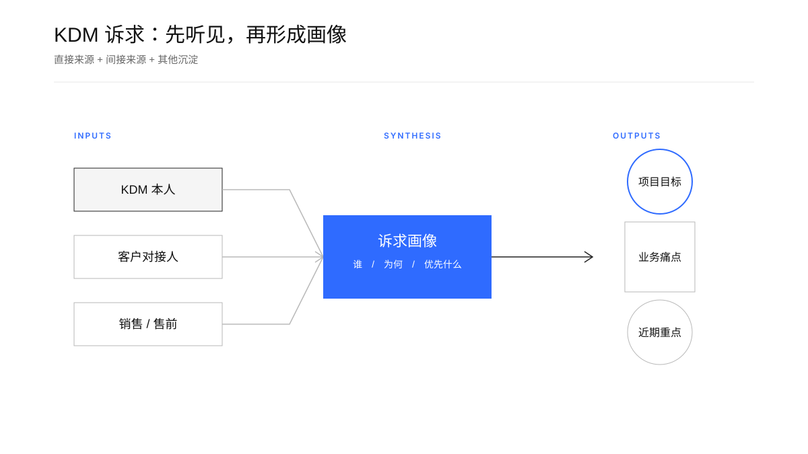
</p>

#### 汇报目标：先让 KDM 满意

<p align="center">
  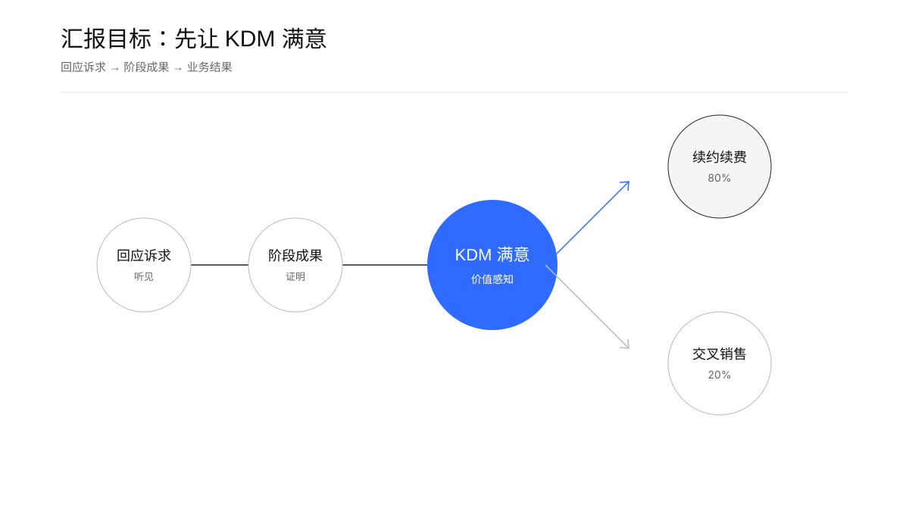
</p>

#### 汇报内容搭建：先骨架，再填充

<p align="center">
  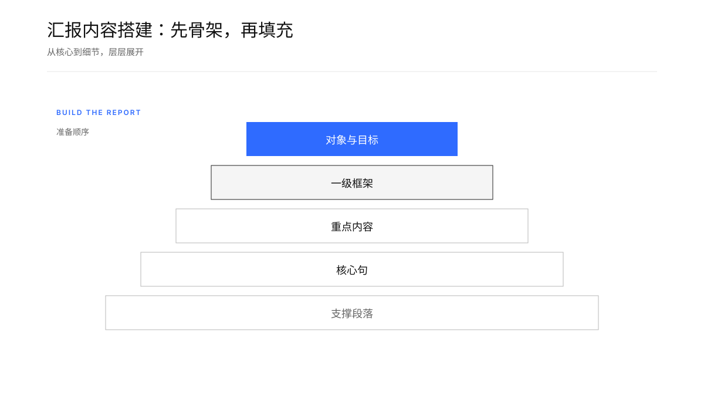
</p>

### 示例三：蓝色波点几何画板的工作方式

这组示例对应 README 中原本没有配图的能力说明：如何从内容提炼判断、如何选择表达方式、如何把画板放回文档，以及如何让技术和非技术读者共享同一张图。

#### 先说清楚，再决定怎么画

<p align="center">
  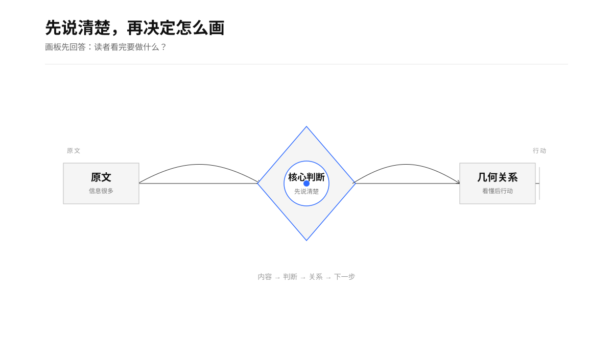
</p>

#### 关系决定表达方式

<p align="center">
  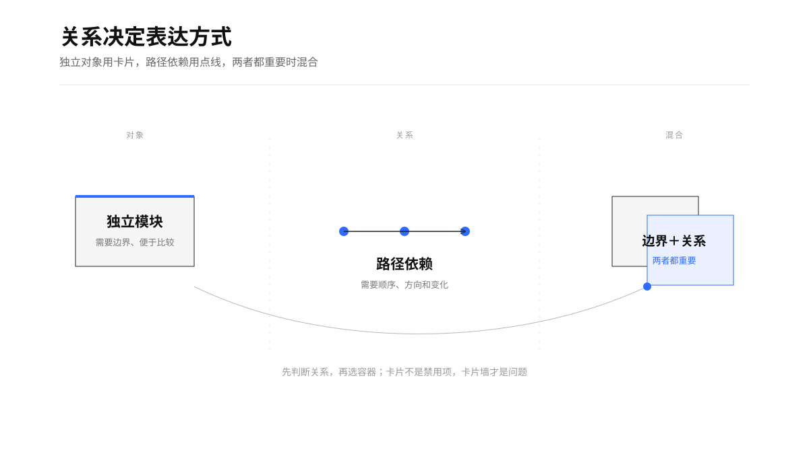
</p>

#### 画板应该跟着主题走

<p align="center">
  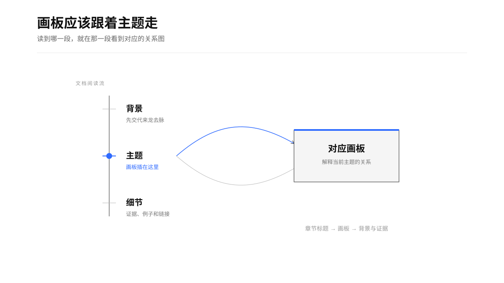
</p>

#### 先给共同语言，再讲专业细节

<p align="center">
  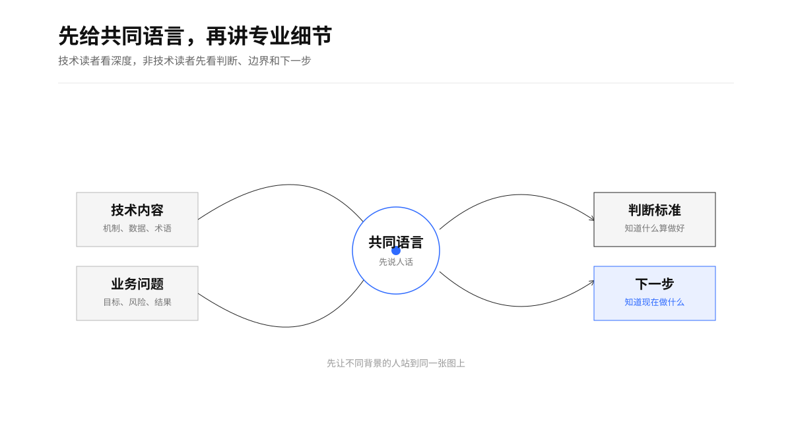
</p>

## English introduction

### What it is

Blue Dot is a Codex Skill for turning dense business content into clear, plain-language, restrained, low-text geometric diagrams that can be reviewed, exported, and embedded into Feishu documents.

It works from natural-language prompts, selected document sections, or existing diagrams. The Skill extracts the core message, identifies the underlying relationships, selects a suitable composition, generates a structured Scene JSON, and renders a deterministic SVG or PNG.

### Why it matters

Business documents often mix timelines, ownership, dependencies, decision rights, inputs, outputs, and evaluation criteria in the same page. A generic diagram generator may produce something visually attractive but semantically loose, text-heavy, or disconnected from the document context.

Blue Dot is designed around six practical outcomes:

1. **Faster understanding.** One board communicates one core judgment at a glance.
2. **Plain-language clarity.** Titles and nodes use concrete actions and outcomes so an unfamiliar reader can understand the board without a glossary.
3. **Semantic fidelity.** Shapes, lines, layers, axes, and whitespace represent meaningful relationships instead of decoration.
4. **Better reading flow.** Boards are placed beside the section they explain, so the visual and written context stay together.
5. **Reusable output.** Scene JSON and deterministic SVG make revisions, validation, and style consistency easier.
6. **Actionable discussion.** The board gives teams a shared object for discussing priorities, ownership, risks, and next steps.
7. **Shared value for mixed audiences.** It states the practical takeaway before technical vocabulary, uses a concise subtitle when one line of explanation helps, and removes duplicate explanations from the surrounding document prose.

### What makes it different

Blue Dot treats visual work as information design rather than image generation:

- It starts with a single core message, not a collection of unstructured labels.
- It prefers plain business language and concrete verbs over abstract jargon.
- It has an editorial geometric feel rather than a card-grid UI: axes, guide lines, anchor points, boundaries, and spatial relationships remain visible when they help explain the structure.
- It maintains one clear focal point and one primary path instead of giving every module equal visual weight.
- It chooses cards for independent, bounded, comparable modules; points and lines for paths, dependencies, networks, and flows; and a hybrid only when both boundaries and relationships matter.
- It applies explicit layout rules for centering, alignment, reading order, grouping, spacing, and relationship-driven density.
- It uses point, line, plane, and volume as a generative visual language: points locate objects, lines reveal movement and connection, planes define groups and fields, and volume shows layered systems or spatial structure.
- It uses rhythm, scale, Gestalt grouping, framing, layers, transparency, modularity, grids, pattern, time, and controlled rules to make relationships legible without adding decoration.
- It chooses the representation before the composition template, so a familiar template never overrides the actual relationship.
- It varies the main composition across a board series while keeping typography, color, spacing, and line language consistent; a six-board set should normally use at least four composition families.
- It retains one proven anchor composition when the content fits, especially the classic `inputs → system/Harness → result` structure for an opening overview.
- It applies a three-second restatement test: a reader should be able to repeat the core judgment from the title and main relationship without first decoding the metaphor.
- It makes the reader's takeaway explicit for mixed technical and non-technical audiences: shared language, judgment criteria, boundaries, or the next action.
- It uses the title for the conclusion, the subtitle for one necessary clarification, and the nodes for actions and outcomes; the document keeps background, evidence, links, and details without repeating the board's local explanation.
- It treats alignment as a tool for readable relationships, not as mechanical column-making; decorative containers are removed when they hide the main path.
- It uses a small, stable visual vocabulary and one accent color.
- It removes redundant explanations before shrinking text or filling empty space.
- It preserves existing boards unless the user explicitly asks for a rearrangement.
- It verifies the document structure and the placement context after writing to Feishu.

### Feishu document behavior

When several boards are requested for a Feishu document, the Skill first reads the document outline and nearby paragraphs. It then creates a mapping of `board topic → section → insertion anchor`, places each board after the paragraph that introduces its topic, and verifies the text before and after every inserted board. When a board title and subtitle already explain the local relationship, the compact form `section heading → board` is preferred and duplicate lead-in prose is removed; background, evidence, links, and details remain in the document. Boards are clustered only when they belong to the same topic or when the user explicitly requests a gallery-style section.

### Example sources

The examples in this repository cover two real document-oriented use cases—OKR alignment and review, and People stakeholder / KDM reporting—plus a visual explanation of the Skill workflow. Together they show how one visual system can express different structures without turning the board into a full-text slide.

## 目录结构

```text
geometry-board-skill/
├── SKILL.md                          # Skill 主说明与工作流
├── agents/openai.yaml                # Codex 中的展示信息
├── references/
│   ├── visual-system.md              # 视觉 Token 与构图模板
│   ├── design-language.md            # 点线面体与视觉关系语言
│   └── scene-json-schema.md          # Scene JSON 协议
├── scripts/validate_scene.py         # Scene JSON 结构校验
└── examples/                         # 实际画板 SVG 示例
    ├── overview/                     # Skill 总览画板与 Scene JSON
    ├── okr/
    ├── kdm/
    └── skill-workflow/               # Skill 工作方式示例与 Scene JSON
```

## 使用方式

在 Codex 中调用 `$geometry-board`，例如：

```text
Use $geometry-board to turn this section into a minimal geometric board.
```

也可以直接提出“把这段内容画成一张图”“把这份飞书文档视觉化”或“在对应段落插入 4 张画板”等请求。

## 校验

对 Scene JSON 运行：

```bash
python3 scripts/validate_scene.py path/to/scene.json
```

校验通过后，再进行 SVG/PNG 渲染和飞书文档写入。

## 许可

本项目以 MIT 许可开源，详见 [LICENSE](LICENSE)。仓库内示例仅使用通用角色名，不含真实姓名或内部数据。
